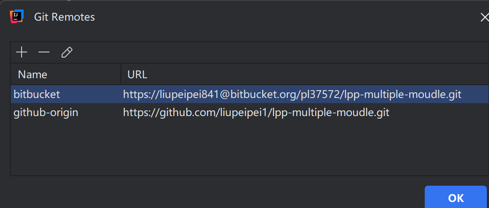
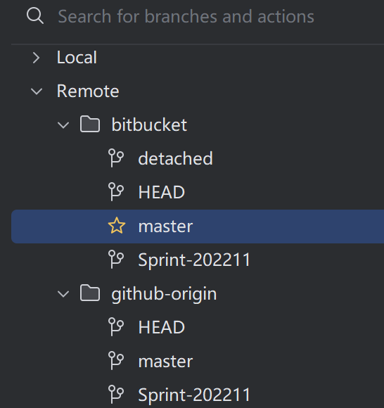

# lpp local mutiple springbootProject for testing
## 本地git地址
本地项目地址:https://github.com/liupeipei1/lpp-multiple-moudle.git
本地bitbucket项目地址：https://bitbucket.org/pl37572/lpp-multiple-moudle/src/master/
### 注意这里代码提交 
先提交到bitbucket 然后再分支push到github上。
在本地设置好 remote git address,push完bitbucket再到git上  保证代码可以有两套

主要本地使用springboot+springcloud+mybatis框架
## mybatis-learning 实现druid+Euraka+swagger**
[https://blog.csdn.net/weixin_42057591/article/details/118328736?spm=1001.2014.3001.5501
](参考)

