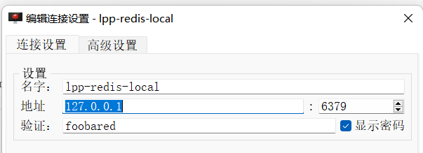

**1. 设置redis 连接**

a. 引入jedis jar
//  <!--redis引入-->
implementation 'redis.clients:jedis:4.3.1'
b.

**2. excel报表导入导出功能**
可以傻瓜式半智能化的快速实现Excel导入导出、Word模板导出、可以仅仅5行代码就可以完成Excel的导入导出
引入jar: //  <!-- AutoPoi Excel工具类-->
`implementation('org.jeecgframework:autopoi-web:1.4.4')`
详细参考文档：[http://doc.jeecg.com/2044224](http://doc.jeecg.com/2044224)
详细文档见：[http://doc.autopoi.jeecg.com](详细文档见：http://doc.autopoi.jeecg.com)
controller:localhost:8081/importExcel  导入入参file student.xsl文件。
目前文件放置位置：E:\loal_code\lpp-multiple-moudle\common\students.xls